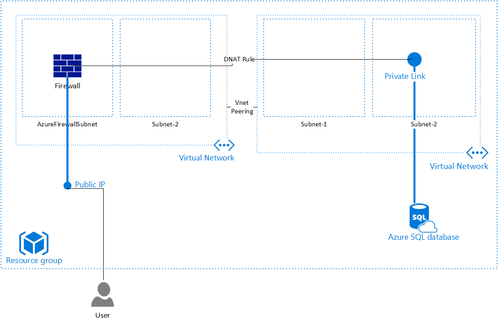

 
# Private Link example
A sample ARM template that deploys
1. 2 Peered VNets
2. a Azure Firewall in the first VNET configure with a dnat rule to send traffic from the public ip address to the private endpoint
3. a Azure SQL Server and a database
4. a Private link enabling access to database from the 2nd virtual network

This was originally put together to test connecting to Azure sql from another service like PowerBI via Azure Firewall and private endpoints, but this setup can be tweaked to test a number of different private link and peering scenarios.
